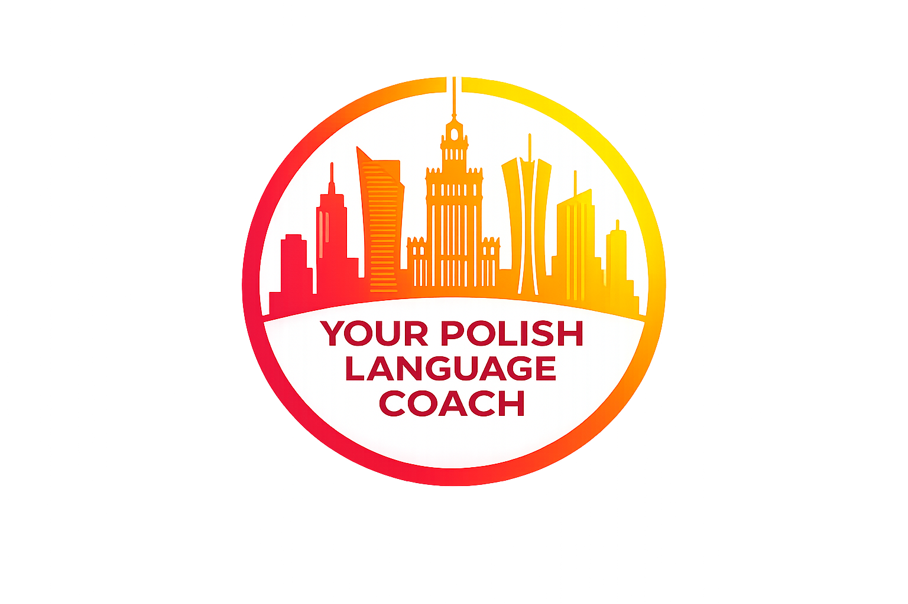

# **Learn Polish for real life with**                  { width="240" }

Practical, personalised Polish coaching for people who want to speak,
understand and use Polish language with confidence.

<!-- [Polish Coaching](coaching.md){ .md-button .md-button--primary }              [10h Polish Crash Course](crash-course.md){ .md-button .md-button--primary} -->

---

### Polish Coaching

Individual Polish language coaching adapted to your level, goals and needs.

Whether you live in Poland, are moving to Poland, have a Polish partner,
work with Polish speakers or simply want to improve your Polish,
the lessons are built around the situations that matter to you.

[Learn more about Polish Coaching](coaching.md)

---

<!-- ### 10h Polish Crash Course

Need useful Polish quickly?

The 10-hour Polish Crash Course is an intensive introduction to practical
Polish, designed to give you the foundations you need to start communicating.

[Discover the 10h Polish Crash Course](crash-course.md) -->

---

### Free Polish Language Resources

Explore my growing multilingual collection of free resources for learning Polish.

Currently available:

- [Polish phonetics in English](resources/english/phonetics.md)
- [Phonétique polonaise en français](resources/french/phonetique.md)
- [Fonética polonesa em português](resources/portuguese/fonetica.md)
- [Polnische Phonetik auf deutsch](resources/german/phonetik.md)

---

### About Your Polish Language Coach

Learn more about my approach to teaching Polish and language coaching.

[About](about.md)

---

### Get in touch

Interested in Polish coaching or the 10-hour crash course?

[Contact me](contact.md)